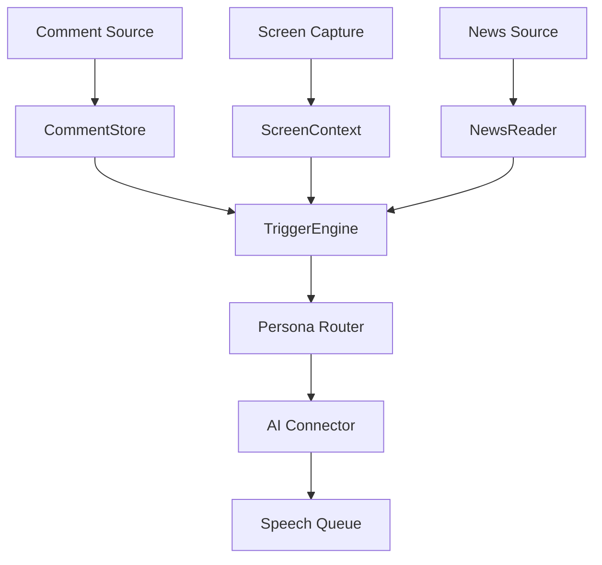

# Stream AI Companion

配信コメント、配信画面、ニュースを文脈として扱い、複数のAIペルソナが音声で自然に反応するためのローカルPoCです。

初期方針は、公開サービスではなくローカルで動かすHTML/JavaScriptアプリです。APIキーはブラウザに保存せず、`config.local.json` をローカルサーバー経由で読み込むか、ファイル選択でメモリにのみ保持します。

## 目的

- 配信コメントにAIが音声で返答する
- 複数モデル、複数ペルソナを切り替えられる
- コメント履歴を保持し、直近の流れを踏まえて返答する
- 配信画面をキャプチャし、画面状況に即した反応を行う
- キーワード、ショートカットキー、定期実行などのトリガーで反応できる
- 時事ニュースを取得、要約、読み上げできる
- 将来的にYouTube/Twitch/OBS連携へ拡張できる

## PoCの起動イメージ

```bash
python3 -m http.server 8080
```

```txt
http://localhost:8080
```

APIキーを含む `config.local.json` はGit管理しません。公開デプロイにも含めません。

## 中核コンセプト



## 主要モジュール

| モジュール | 役割 |
|---|---|
| `CommentStore` | コメント履歴を保持し、直近文脈と要約文脈を提供する |
| `ScreenContext` | 画面キャプチャと画像説明を保持する |
| `TriggerEngine` | キーワード、ショートカット、定期実行、手動発火を判定する |
| `PersonaRouter` | 反応するペルソナとモデルを選ぶ |
| `AIConnector` | OpenAI、OpenRouter、Gemini、ローカルLLMなどを抽象化する |
| `SpeechQueue` | 応答音声の順番、割り込み、クールダウンを制御する |
| `NewsReader` | RSS等からニュースを取得し、要約して読み上げキューへ入れる |

## GitHub Issues

開発タスクは `issues/` にMarkdownで整理しています。GitHubにリポジトリを作成後、`gh` CLIが使える環境で次を実行するとIssueを作成できます。

```bash
./scripts/create-github-issues.sh
```

## 参考

- ニュース読み上げ機構は `azumag/soviet_now` を参考にする予定です。
- GitHub上で該当リポジトリの詳細を確認できたら、RSS取得、要約、読み上げキュー、スケジューリングの構造を移植対象として再検討します。

