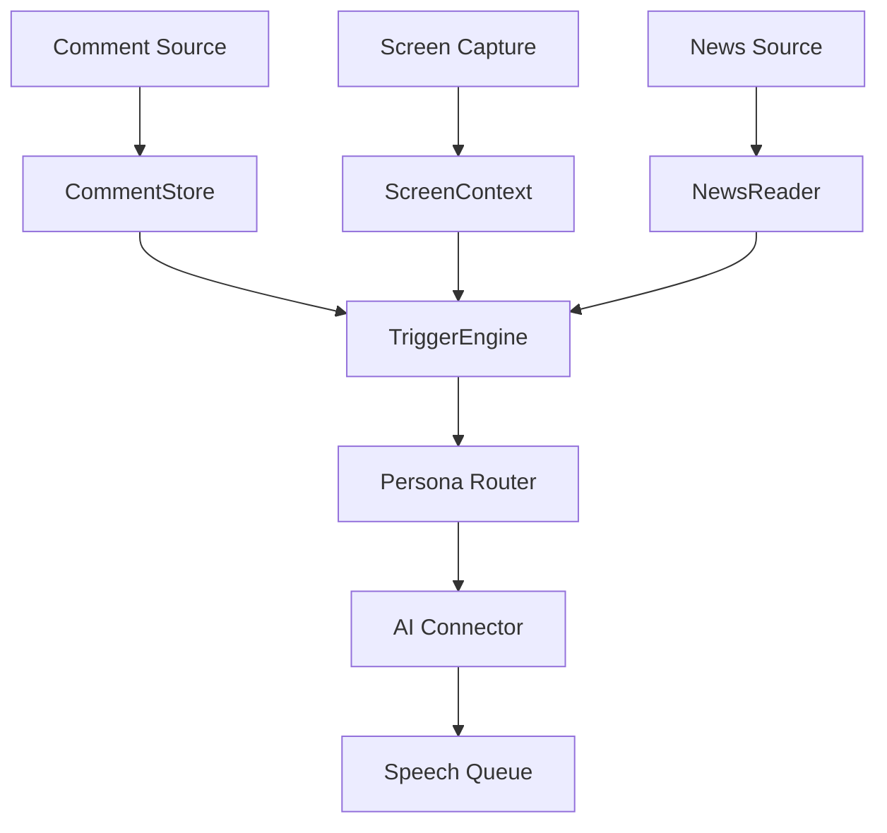

# Stream AI Companion

配信コメント、配信画面、ニュースを文脈として扱い、複数のAIペルソナが音声で自然に反応するためのローカルPoCです。

初期方針は、公開サービスではなくローカルで動かすHTML/JavaScriptアプリです。APIキーはブラウザに保存せず、`config.local.json` をローカルサーバー経由で読み込むか、ファイル選択でメモリにのみ保持します。

## 目的

- 配信コメントにAIが音声で返答する
- 複数モデル、複数ペルソナを切り替えられる
- コメント履歴を保持し、直近の流れを踏まえて返答する
- 配信画面をキャプチャし、画面状況に即した反応を行う
- キーワード、ショートカットキー、定期実行などのトリガーで反応できる
- 時事ニュースを取得、要約、読み上げできる
- 将来的にYouTube/Twitch/OBS連携へ拡張できる

## 起動方法

```bash
cp config.local.example.json config.local.json   # 初回のみ。APIキーを書き込む
python3 scripts/serve.py 8080
```

- `http://localhost:8080/` — 操作卓 (配信者用UI)
- `http://localhost:8080/obs.html` — OBS/配信画面用の表示専用UI ([docs/obs-mode.md](docs/obs-mode.md))

操作卓を開くと `config.local.json` を自動読込します (「サーバーから読込」「ファイルを選択」でも可)。
APIキーを含む `config.local.json` はGit管理しません。公開デプロイにも含めません。読み込んだキーはメモリ保持のみで、LocalStorage等には保存されません。

`scripts/serve.py` は静的ファイル配信に加え、設定エディタ (「設定を編集」→「保存して適用」) からの
保存要求 (`PUT /config.local.json`) を受け付け、ディスク上の `config.local.json` を直接書き換えます。
127.0.0.1 のみで待受けるため外部には公開されません。`python3 -m http.server` でも閲覧はできますが、
保存要求には対応していないため設定エディタでの保存は失敗します (その場合は「JSONエクスポート」で
手動保存してください)。

### APIキーなしで試す

`config.local.example.json` にはモックコネクタとテスト用ペルソナが入っているため、
そのまま `config.local.json` にコピーするだけで動作確認できます (openai/openrouter系ペルソナはOFFにするか、キーを設定してください)。

1. コメント欄に「テスト」を含むコメントを送信 → テストAI(モック)が応答し読み上げる
2. `Alt+3` → テストAI(モック)を手動発話
3. ニュースの `sources` を `{ "name": "mock", "type": "mock" }` にすると、モックニュースの取得→要約→読み上げも試せる

## 中核コンセプト



## 主要モジュール

| モジュール | 実装 | 役割 |
|---|---|---|
| `CommentStore` | `src/comment-store.js` | コメント履歴 (リングバッファ) と長期要約 `streamSummary` を保持する |
| `ScreenContext` | `src/screen-capture.js` | 画面キャプチャと画像説明を保持する (`maxAgeSeconds` で鮮度管理) |
| `TriggerEngine` | `src/trigger-engine.js` | キーワード、ショートカット、定期実行、確率、手動発火を判定する |
| `PersonaRouter` | `src/persona-router.js` | 反応するペルソナを選び、最大応答数とクールダウンを守る |
| `AIConnector` | `src/connectors.js` | OpenAI / OpenRouter / OpenAI互換 / モックを抽象化する |
| `ContextBuilder` | `src/context-builder.js` | コメント・画面・ニュース文脈をプロンプトにまとめる |
| `SpeechQueue` | `src/speech-queue.js` | Web Speech APIで順番に読み上げ、停止/スキップ/全消去を制御する |
| `NewsReader` | `src/news-reader.js` | RSSからニュースを取得し、要約して読み上げキューへ入れる |
| `CommentSource` | `src/comment-sources.js` | 手動入力/将来のYouTube・Twitchを同じ形で流し込む ([docs/comment-sources.md](docs/comment-sources.md)) |

## GitHub Issues

開発タスクは `issues/` にMarkdownで整理しています。GitHubにリポジトリを作成後、`gh` CLIが使える環境で次を実行するとIssueを作成できます。

```bash
./scripts/create-github-issues.sh
```

## 参考

- ニュース読み上げ機構は `azumag/soviet_now` (broadcast/radio_news.sh) を参考にしています。
  移植候補のパターン (AIスパム判定・タイトル正規化による重複排除など) は
  [docs/configuration.md](docs/configuration.md) の末尾にメモしています。

